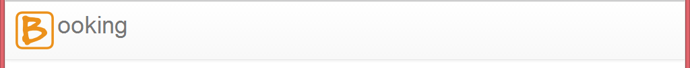
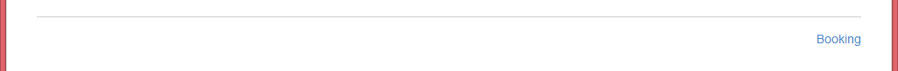

# Assignment #

* Due: 11/12/2013, 24:00

This assignment is to setup your initial page template. Please review the previous project we did before starting this setup. If you are still not sure, ask others to help.

# Checklist #

* Have you commited your work to your local repository?
* Have you pushed your local repository to your remote repository?
* Have you sent a pull request from your `dev` branch to `aliencube/dev`?

# Sync GitHub Repository #

* Get your local `dev` branch synchronised with the one on `aliencube/dev`.

# HTML5 Boilerplate #

* Apply HTML5 Boilerplate template that is stored in `Libraries\html5-boilerplate-4.3.0` to your `_Layout.cshtml`.

# Bootstrap 3 #

* Apply Bootstrap 3 to your `_Layout.cshtml`.

# Layout #

* Create layout using Bootstrap 3, [http://getbootstrap.com](http://getbootstrap.com).
* Use a logo, if necessary.

## Header & Footer ##

* Implement the following header, `_Header.cshtml`.

* Implement the following footer, `_Footer.cshtml`.

## `Home/Index` View ##

* Implement the following for your `/Home/Index` view.

