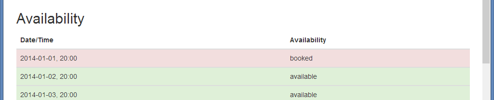

# Assignment #

* Due: 17/12/2013, 24:00

This assignment is to setup a calendar page. If you are still not sure, ask others to help.

# Checklist #

* Have you commited your work to your local repository?
* Have you pushed your local repository to your remote repository?
* Have you sent a pull request from your `dev` branch to `aliencube/dev`?

# Sync GitHub Repository #

* Get your local `dev` branch synchronised with the one on `aliencube/dev`.

# Implement `Booking` Controller and `Index` Action #

* Add `Booking` controller with `Index` action.
* When accessing to `/booking`, the page should list up availabilities of all time slot. Based on availiability, each time slot should be highlighted below:
  * `Green`: available &ndash; NOT booked
  * `Red`: unavailable &ndash; booked
* Use `/Responses/availability.json` data for your reference.
* Uses the same approach what we did for the `/Home/Index` page.

The result page might look like:

# References #

* AngularJS: [http://docs.angularjs.org/api](http://docs.angularjs.org/api)
